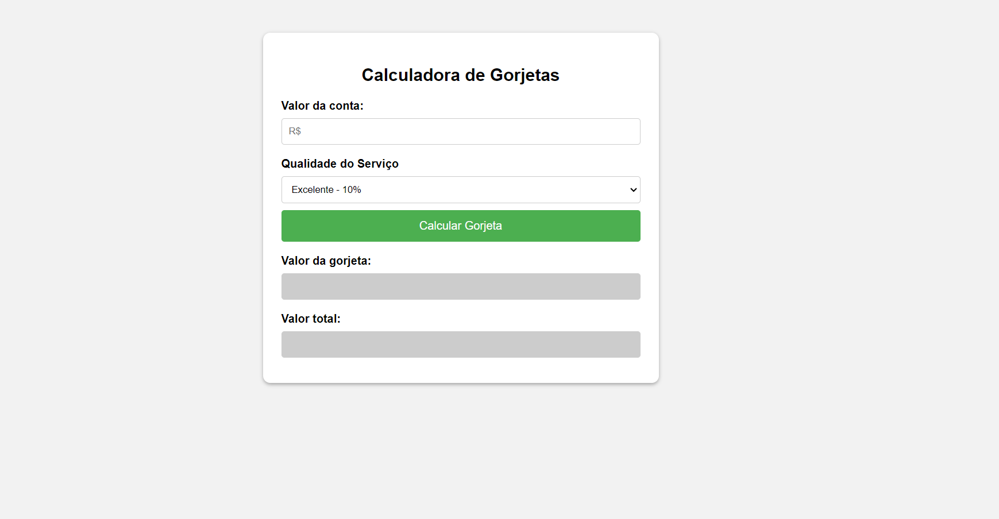

# Barra de Progresso

## 📖 Introdução 

Este é um projeto de estudo prático em JavaScript, utilizando DOM para a criação de uma aplicação de uma Calculadora de Gorjeta. Projeto desenvolvido utilizando HTML, CSS e Javascript.

## 🔗Link de Acesso
- Deploy: [clique aqui!](https://danielemidio1988.github.io/calculadora-de-gorjeta/)

## 👥Equipe
| [<br><sub>Daniel Emidio</sub>](https://github.com/DanielEmidio1988) |
| :---: |

## 🧭Status do Projeto
- ⏳Concluído

## 📄Concepção do Projeto

### Layout

| <br><sub>Home Page</sub> | 
| :---: |

### Funcionalidades
```bash
- Após informar os valores da conta e clicar em 'Calcular Gorjeta', a aplicação retornará o cálculo de acordo com a qualidade do serviço informada.
```

## 💡Programas utilizados:
- VSCode

## 💻Tecnologias 


## 📫 Contato

E-mail: emidio.daniel@hotmail.com
